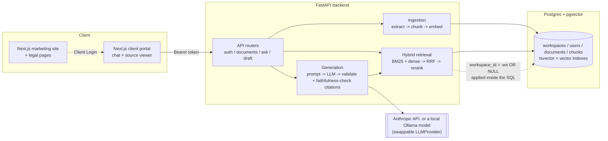

# Meridian Legal Intelligence

**AI-powered legal research and drafting — every answer cited, every citation verified.**

Upload contracts and filings, search a case-law corpus alongside them, ask
questions in plain English, and get answers grounded in your own documents —
with inline citations that link back to the exact passage. Request a first
draft of a clause rewrite and get cited, reviewable language instead of a
blank page. Built as a legal-AI consultancy's platform, not a law firm: it
does not practice law or give legal advice, and every output is meant to be
reviewed by a licensed attorney before use.

[**Live-tested build log →**](docs/BUILD_LOG.md) · Not legal advice — see the
AI Output Disclaimer at `website/src/app/disclaimer/page.tsx`.

---

## Why this exists

Most "AI legal research" demos fall apart the moment you ask a question the
source material doesn't answer — they guess anyway, confidently. This
project was built around the opposite instinct: **an answer the system can't
ground is worse than no answer.** Concretely:

- Every citation in a generated answer is checked against the chunks
  actually retrieved for that query — an index outside that set gets the
  whole answer rejected, not silently kept.
- A dedicated faithfulness check (reusing the retrieval reranker as a cheap
  entailment proxy) catches the case where a citation *exists* but the claim
  attached to it isn't actually what the passage says.
- When retrieval can't find solid support for a question, the system says
  **"I couldn't find support for this"** instead of answering anyway.
- One workspace's documents can never appear in another workspace's
  results — the filter is applied *inside* the retrieval query itself
  (`WHERE workspace_id = :ws OR workspace_id IS NULL`), not as a check
  bolted on after the fact.

On the 36-item evaluation set (real generation via a local Ollama model, no
mocking): **36/36 answered, citation accuracy 1.00, faithfulness 1.00.**
See [docs/BUILD_LOG.md](docs/BUILD_LOG.md) for the methodology and the real
bugs found and fixed along the way — the honest version of how that number
was reached, not just the number itself.

## Features

| | |
|---|---|
| 📄 **Document ingestion** | PDF/DOCX upload, clause-aware chunking (splits on `ARTICLE`/`SECTION`/numbered headings, not fixed token windows), OCR fallback for scanned PDFs |
| 🔎 **Hybrid retrieval** | BM25 full-text + dense embeddings, fused via Reciprocal Rank Fusion, then cross-encoder reranked |
| 💬 **Grounded Q&A** | Inline `[n]` citations, validated against the retrieved set, with a confidence gate and a faithfulness check before anything reaches the user |
| ✍️ **Drafting mode** | "Rewrite the indemnity clause to favor the buyer" → a cited first draft with tracked reasoning |
| 🔒 **Workspace isolation** | Enforced at the SQL query level, audited end-to-end from ingestion through the API (spoofed `workspace_id` in a request body is a provable no-op) |
| 🌐 **Public case-law corpus** | Cross-document research alongside your own files, scoped correctly |
| 🤖 **Swappable LLM** | Anthropic by default; falls back automatically to a local Ollama model if no API key is set — zero cloud dependency required |
| 📊 **Eval harness** | 36-item gold Q/A set, recall@k/precision@k/MRR, citation accuracy, faithfulness, a reranker-on/off comparison table |
| 🏢 **Client portal + marketing site** | Branded Next.js apps — chat + source viewer for clients, a public site with real Terms/Privacy/AI-disclaimer pages |

## Architecture



## Tech stack

- **Backend:** Python, FastAPI, SQLAlchemy, Postgres + `pgvector`
- **Retrieval:** `sentence-transformers` embeddings + cross-encoder reranker, Postgres full-text search
- **Generation:** `anthropic` SDK, or local inference via Ollama — behind one swappable `LLMProvider` interface
- **Client portal & marketing site:** Next.js (App Router), TypeScript, Tailwind CSS
- **Infra:** Docker Compose for local dev (notes on a Kubernetes path in the build log)
- **Testing:** `pytest` (47 backend tests against a live Postgres container), `npm run build` for both frontend apps

## Quickstart

```bash
# 1. Postgres (pgvector)
docker compose up -d

# 2. backend
cd backend
python3 -m venv .venv && source .venv/bin/activate
pip install -r requirements.txt
cp ../.env.example .env   # add ANTHROPIC_API_KEY, or run `ollama serve` locally
python -m pytest -q       # 47 tests, all against the live Postgres container
uvicorn app.api.main:app --reload --port 8000

# 3. client portal (separate terminal)
cd frontend
cp .env.local.example .env.local
npm install && npm run dev   # http://localhost:3000

# 4. marketing site (separate terminal, optional)
cd website
cp .env.local.example .env.local
npm install && npm run dev -- --port 3001   # http://localhost:3001
```

Or skip the UI entirely:

```bash
cd backend && source .venv/bin/activate
python -m app.ingestion.cli init-workspace "Acme Law LLP" "alice@acme.law" "Alice Attorney"
python -m app.ingestion.cli ingest <workspace_id> <user_id> /path/to/contract.pdf
python -m app.generation.cli ask <workspace_id> "What does the indemnification clause say?"
python -m app.eval.run_eval --generation   # retrieval + citation accuracy + faithfulness
```

A sample contract is included at [`samples/demo_contract.docx`](samples/demo_contract.docx)
if you want something to upload immediately.

## Project structure

```
.
├── docker-compose.yml       # Postgres + pgvector
├── backend/
│   └── app/
│       ├── ingestion/       # extract (PDF/DOCX/OCR), clause-aware chunking, pipeline, CLI
│       ├── retrieval/       # embeddings, reranker, hybrid search, CLI
│       ├── generation/      # provider (Anthropic/Ollama), prompts, citations, faithfulness, answer, draft, CLI
│       ├── eval/            # gold Q/A fixtures, seed script, metrics, run_eval
│       ├── api/             # FastAPI app, routers, schemas, auth
│       ├── core/            # config, db, security
│       └── models/          # SQLAlchemy models
│   └── tests/               # one file per package above, all against live Postgres
├── frontend/                # Next.js client portal — chat + source viewer
├── website/                 # Next.js marketing site — includes /terms, /privacy, /disclaimer
├── samples/                 # sample document for manual testing
└── docs/BUILD_LOG.md        # full phase-by-phase build history, bugs found and fixed, real eval numbers
```

## Evaluation

```
Retrieval metrics (k=1, n=36 gold Q/A pairs)
config             recall@1  precision@1  MRR
hybrid + rerank    0.94      0.944        0.94

Generation metrics (n=36 gold Q/A pairs, real local generation)
citation accuracy (cites gold passage)    1.00
faithfulness (cited sentences supported)  1.00
```

Run it yourself: `python -m app.eval.run_eval --generation`. The full
methodology, including the retrieval-confidence and citation-faithfulness
bugs found via live testing and how each was diagnosed and fixed, is in
[docs/BUILD_LOG.md](docs/BUILD_LOG.md) (Phases 9–11).

## Known limitations

- **Public case law is synthetic**, written for this project — CourtListener
  now requires an authenticated API token this environment didn't have.
  `ingest_file()` already supports arbitrary text with `workspace_id=None`,
  so real ingestion is a small addition once a token is available.
- **Auth is intentionally minimal** (email only, no password) — fine for a
  demo, not for production. The part that matters for workspace isolation
  (server-side resolution from a verified token, never client input) is in
  place regardless.
- **Legal pages are AI-drafted templates**, not reviewed by a licensed
  attorney — every page says so. Have counsel complete the
  governing-law/jurisdiction placeholders before relying on them.
- No Alembic migrations, no queue-based ingestion (large uploads are
  processed synchronously, capped at 25MB) — both noted as roadmap items.

Full list, with context for each, in [docs/BUILD_LOG.md](docs/BUILD_LOG.md).

## License

MIT — see [LICENSE](LICENSE). The code is free to use, modify, and
distribute. This covers the source code only: it does not grant any right
to the "Meridian Legal Intelligence" name, logo, or brand, and it does not
make the Terms/Privacy/Disclaimer pages in `website/` into usable legal
documents for your own organization any more than copying them would —
see the known limitations above.

---

*Not legal advice. Meridian does not practice law or provide legal advice.
All output requires review by a licensed attorney before use.*
